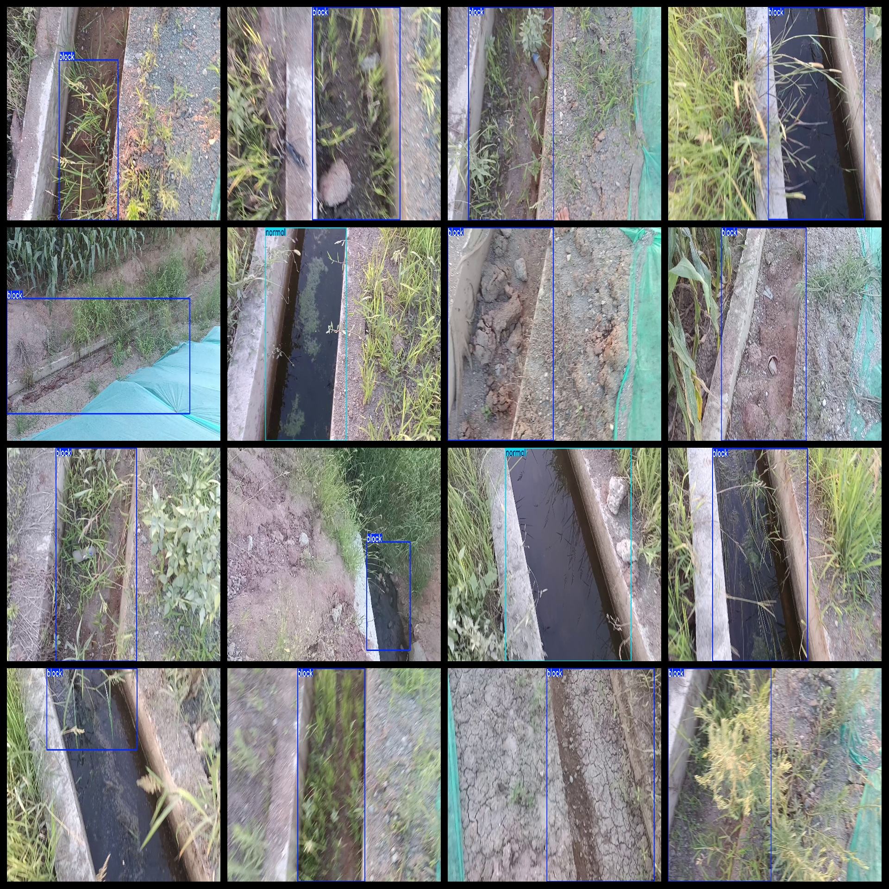

# Slope Drainage Ditch Blockage Dataset is a dataset containing 1488 images in the format of VOC+YOLO.

The slope drainage ditch blockage dataset consists of 1488 images in the VOC+YOLO format.

Dataset format: Pascal VOC format + YOLO format (without txt files containing split paths, only including jpg images along with their corresponding VOC format xml files and YOLO format txt files).

Number of images (number of jpg files): 1488

Number of annotations (number of xml files): 1488

Number of annotations (number of txt files): 1488

Number of annotation categories: 2

Repository location: firc-dataset

Annotation category names (note that the order of categories in the YOLO format does not correspond with this, but is based on the "labels" folder's "classes.txt" file): ["block", "normal"]

Number of bounding boxes for each category:

Block (blockage/deposit) bounding box count = 1328

Normal (normal) bounding box count = 295

Total bounding box count = 1623

Number of images per category:

Block (blockage/deposit) images per category = 1193

Normal (normal) images per category = 295

Image resolution: 1920x1080

Annotation tool used: labelImg

Annotation rule: draw a rectangle around the category

Important note: The dataset does not have separate training, validation, or test sets; you need to partition them yourself.

Special statement: This dataset does not guarantee any accuracy in the models trained or weight files.

## Images

---

Here is a pay link on Stripe (https://buy.stripe.com/3cs8yP7sY87d0vu9AB). Please contact me lonlonago@foxmail.com after funding $89, and I will send you a complete data files, thank you!

